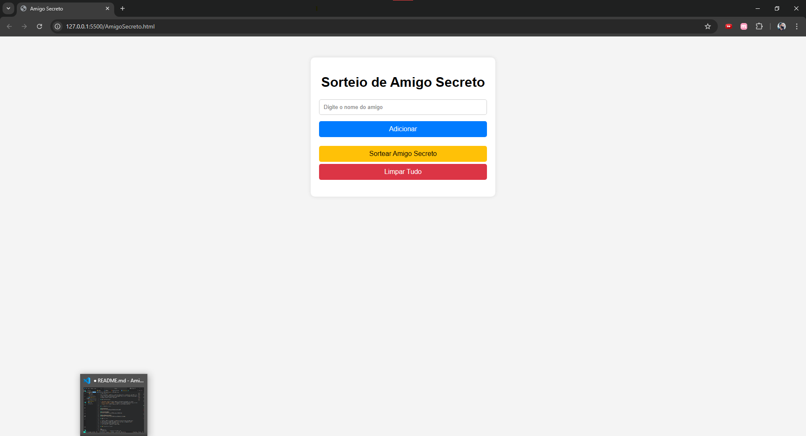
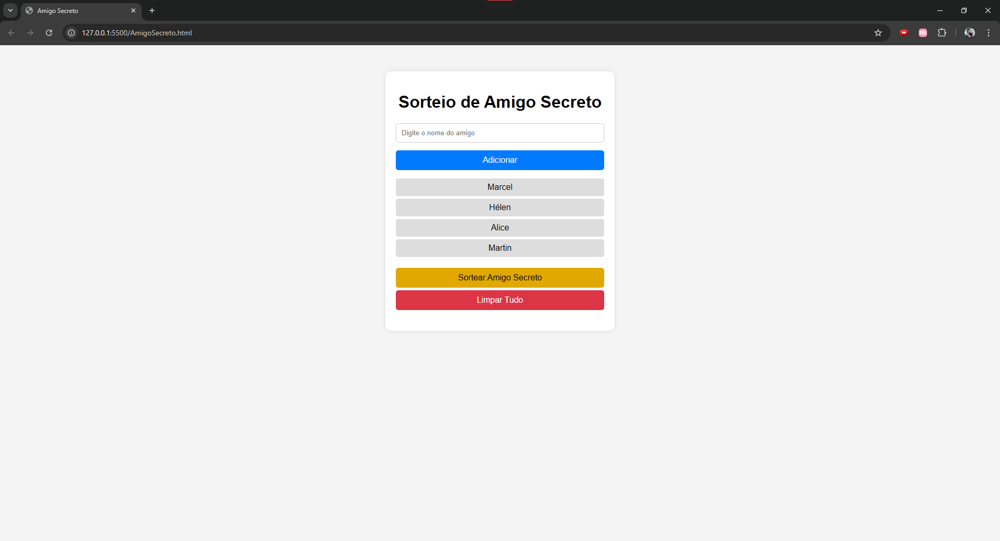
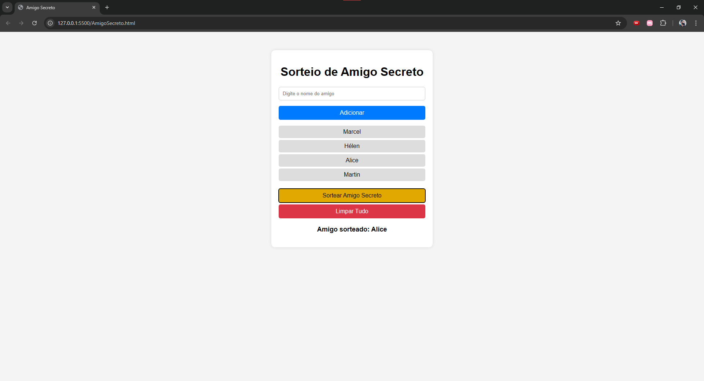

# Amigo Secreto 🎉

Este é um projeto simples de sorteio de Amigo Secreto desenvolvido com HTML, CSS e JavaScript. A aplicação permite adicionar nomes à lista, sortear aleatoriamente um amigo e limpar os dados inseridos.

## 🚀 Funcionalidades

- **Adicionar amigos**: Insira nomes na lista para participar do sorteio.
- **Sortear um amigo secreto**: O sistema escolhe aleatoriamente um nome da lista.
- **Limpar tudo**: Exclui todos os nomes e o resultado do sorteio.

## 🖥️ Capturas de Tela

### Tela Inicial


### Lista de Amigos


### Resultado do Sorteio


## 📜 Como Usar

1. Digite o nome de um amigo no campo de entrada e clique em "Adicionar".
2. Após inserir os nomes desejados, clique em "Sortear Amigo Secreto".
3. O nome sorteado será exibido na tela.
4. Para reiniciar, clique em "Limpar Tudo".

## 📂 Estrutura do Projeto

```
AmigoSecreto/
│── index.html       # Estrutura da aplicação
│── styles.css       # Estilização do layout
│── script.js        # Lógica do sorteio
│── screenshots/     # Capturas de tela da aplicação
│── README.md        # Documentação do projeto
```

## 📌 Tecnologias Utilizadas

- HTML5
- CSS3
- JavaScript

## 📜 Licença

Este projeto é de código aberto e pode ser utilizado livremente. 😊

---

💡 **Dica:** Caso queira personalizar ainda mais, sinta-se à vontade para modificar o código e deixar o projeto com a sua cara! 🎨